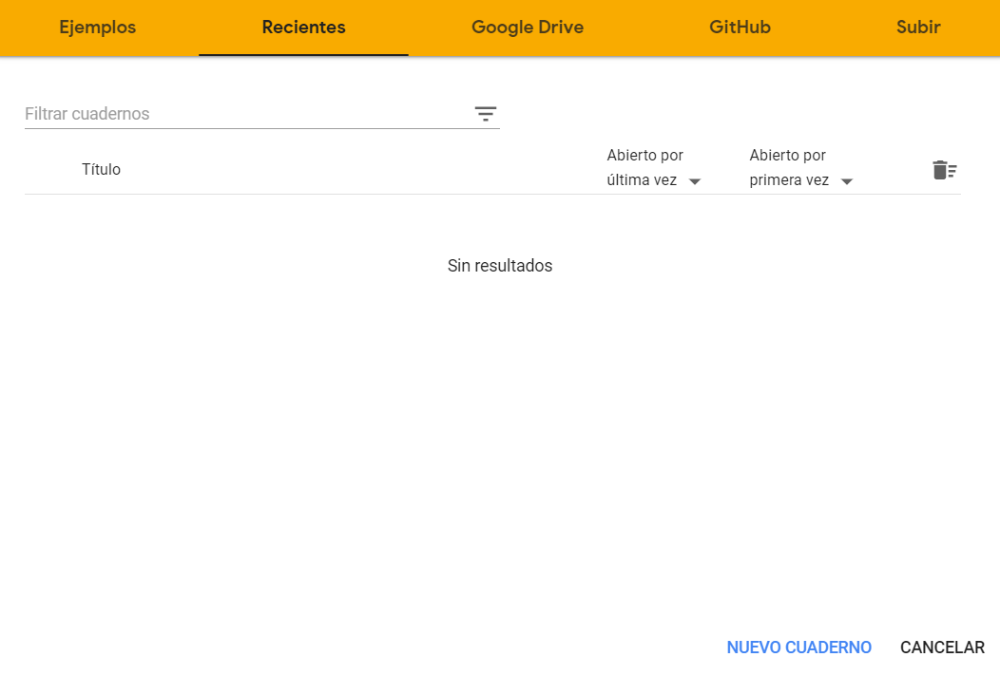
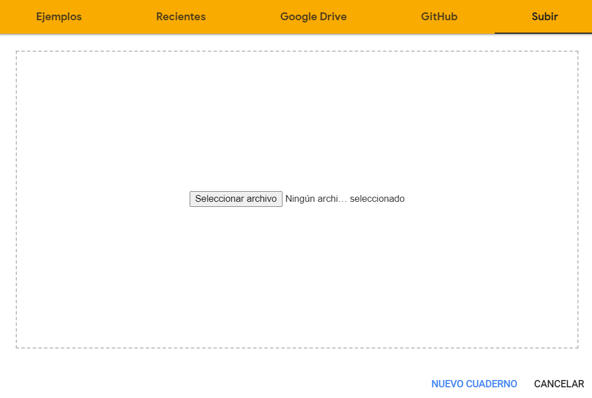
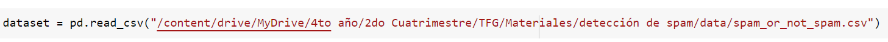

# TFG
Notebooks de Google Colab con el código del TFG: Aprendizaje Automático para Detección de Tráfico IoT Anómalo, Spam y Malware

Para utilizar los notebooks, hay que descargarlos y abrirlos en [Google Colab](https://colab.research.google.com/). 

A continuación, seleccionamos la pestaña de "subir", y arrastramos o abrimos el notebook deseado. 

Una vez abierto el fichero, podemos ejecutar las celdas en el orden que aparecen para el correcto funcionamiento. Si es la primera vez que se abre el fichero y no se le ha aplicado ningun cambio, mantiene los resultados obtenidos de última ejecución.

## Tener en cuenta
Las rutas que se le indican a las funciones para leer los ficheros son mis rutas de acceso. Cada uno debe cambiarlas con la dirección en la que se encuentren los ficheros correspondientes. En el caso del tráfico IoT no es necesario. En los otros dos sí. Por ejemplo, en el caso de Detección de Spam con el dataset obtenido de Kaggle:

